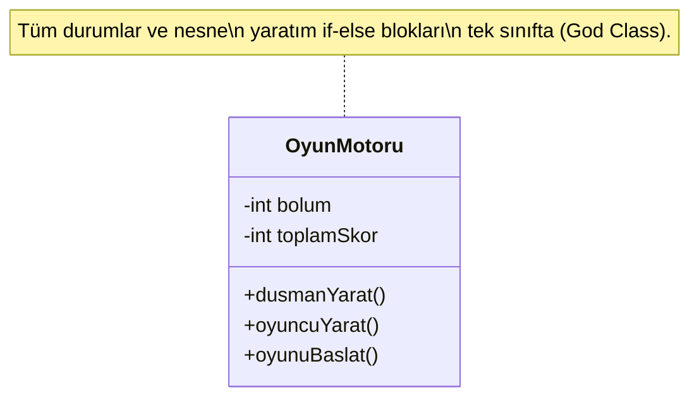
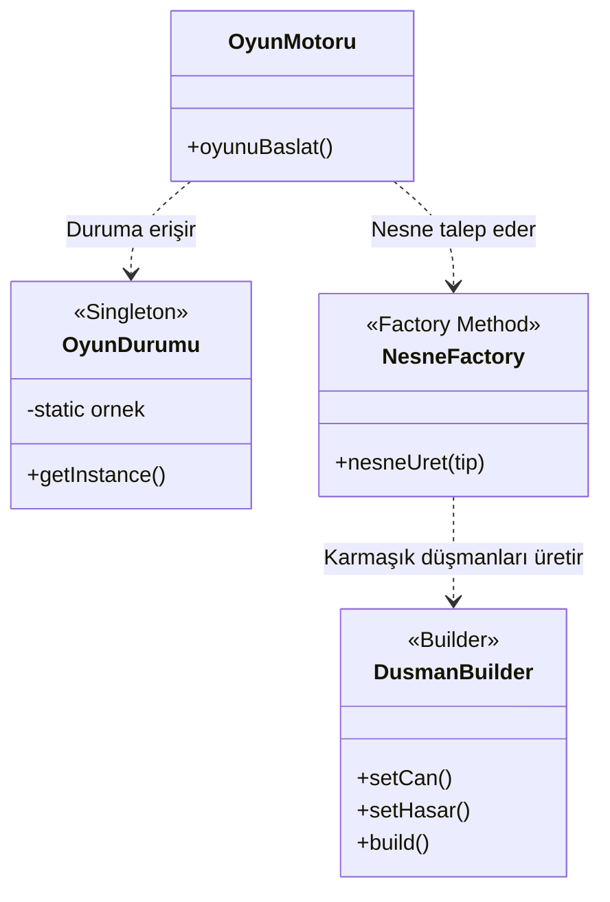

# Uygulanan Tasarım Örüntüleri (Faz 1)

### 1. Singleton (`oyundurumu`)
* **Nerede:** Oyunun bölüm, toplam skor ve devam edip etmeme durumunun tutulduğu yerde uygulandı.
* **Neden:** Tüm nesnelerin tek bir merkezi oyun durumuna erişmesi gerekiyordu.
* **Ne Kazandırdı:** Global değişken karmaşasını önledi, bellekte ikinci bir durum nesnesi üretilmesini engelledi.

### 2. Factory Method (`nesnefactory`)
* **Nerede:** Oyuncu, düşman ve eşya nesnelerinin ilk üretim aşamasında uygulandı.
* **Neden:** `OyunMotoru` sınıfını doğrudan `new` anahtar kelimesiyle nesne yaratma yükünden kurtarmak için.
* **Ne Kazandırdı:** Kodun Açık/Kapalı Prensibine (Open/Closed Principle) uymasını sağladı. Yeni bir nesne tipi eklendiğinde ana motor kodunun değişmesine gerek kalmadı.

### 3. Builder (`dusmanbuilder`)
* **Nerede:** 3. Bölümdeki `PATRON` nesnesi ve sonraki bölümlerdeki çok parametreli düşmanların üretiminde uygulandı.
* **Neden:** Can, saldırı, hız gibi çok sayıda isteğe bağlı parametreye sahip nesneleri esnek üretmek için.
* **Ne Kazandırdı:** Yapıcı metot (constructor) kirliliğini önledi ve koda akıcı bir okunabilirlik kazandırdı.

### UML Sınıf Diyagramı (Önce / Sonra)

**Önceki Yapı (God Class):**

**Sonraki Yapı (Tasarım Örüntüleri ile):**
